# 🚀 Explore-Plan-Configure-Commit Workflow Commands

A comprehensive set of slash commands designed to create a systematic, professional workflow for Doom Emacs configuration development. These commands leverage specialized AI agents for optimal execution of each workflow phase.

## 📋 Overview

These commands implement a structured workflow that guides you from initial exploration through to production-ready configuration changes:

```mermaid
graph TD
    A[🔍 /explore-doom] --> B[📋 /plan-config]
    B --> C[🔨 /atomize-plan]
    C --> D[💻 /implement-task<br/>no commits]
    D --> E[🧪 /test-config]
    E --> F[⚡ /profile-startup]
    F --> G[🔄 /doom-sync]
    G --> H[📝 /commit-feature<br/>creates commits]
    H --> I[🚀 /pr-feature]
    D --> J[📊 /workflow-status]
    J --> D
```



## 🤖 Specialized Agents

The workflow commands are powered by specialized agents that ensure high-quality execution:

### Workflow-Specific Agents:
- **`doom-explorer`**: Deep Doom configuration analysis and pattern discovery
- **`doom-planner`**: Creates detailed configuration implementation documents
- **`issue-architect`**: Transforms plans into atomic GitHub issues
- **`commit-craftsman`**: Creates perfect semantic commits

### Supporting Agents (Auto-invoked):
- **`security-auditor`**: Reviews configurations for security best practices
- **Additional agents available**: Can be added as needed for specific workflows

## 🎯 Command Reference

### 1. `/explore-doom <module-or-area>`
**Purpose**: Deep exploration and analysis of Doom modules or configuration areas
**Agent**: Uses `doom-explorer` for systematic analysis

**Usage**:
```
/explore-doom org-mode
/explore-doom keybindings
/explore-doom completion
```

**Output**: 
- Comprehensive analysis document at `docs/explorations/<module>-exploration.md`
- Architecture overview, patterns, dependencies, and recommendations

**When to Use**:
- Starting work on a configuration area
- Understanding existing setup before planning changes
- Investigating integration points between modules

---

### 2. `/plan-config <configuration-name>`
**Purpose**: Generate a detailed implementation plan following PLAN.md structure
**Agent**: Uses `doom-planner` for comprehensive planning

**Usage**:
```
/plan-config gtd-system
/plan-config email-setup docs/explorations/email-exploration.md
```

**Output**:
- Detailed plan document at `docs/plans/<config>-PLAN.md`
- Phased implementation approach
- Atomic task breakdown
- Risk assessment and success metrics

**When to Use**:
- After exploration phase
- Before starting implementation
- When systematic approach is needed

---

### 3. `/atomize-plan <plan-file> [milestone-name]`
**Purpose**: Convert plan into atomic GitHub issues for tracking
**Agent**: Uses `issue-architect` for issue creation

**Usage**:
```
/atomize-plan docs/plans/gtd-system-PLAN.md "GTD Implementation"
/atomize-plan docs/plans/performance-PLAN.md
```

**Output**:
- GitHub issues created with proper labels
- Milestone created (if specified)
- Issue tracking document at `docs/issues/<config>-issues.md`

**When to Use**:
- After plan approval
- Before starting implementation
- For systematic task tracking

---

### 4. `/implement-task <issue-number>`
**Purpose**: Systematically implement a specific GitHub issue (without committing)
**Agents**: Auto-invokes doom-explorer, security-auditor as needed

**Usage**:
```
/implement-task 42
/implement-task https://github.com/user/doom-config/issues/42
```

**Actions**:
- Fetches issue details
- Creates feature branch if needed
- Implements configuration changes
- Runs validation checks
- Updates issue with progress
- **Note**: Does NOT create commits - use `/commit-feature` after

**When to Use**:
- Implementing atomic tasks from plan
- Working on specific configuration changes
- Making tracked improvements

---

### 5. `/test-config`
**Purpose**: Comprehensive testing of Doom configuration
**Validation**: Syntax, loading, packages, keybindings, performance

**Usage**:
```
/test-config
```

**Output**:
- Comprehensive test report
- Performance metrics
- Issue identification
- Recommendations for fixes

**When to Use**:
- After configuration changes
- Before committing changes
- Regular configuration health checks

---

### 6. `/profile-startup`
**Purpose**: Detailed startup performance analysis and optimization
**Analysis**: Timing, memory usage, bottlenecks, recommendations

**Usage**:
```
/profile-startup
```

**Output**:
- Detailed performance profile
- Optimization recommendations
- Comparative analysis
- Action items for improvement

**When to Use**:
- When startup feels slow
- After adding new packages
- Performance optimization sessions

---

### 7. `/doom-sync`
**Purpose**: Sync Doom configuration with comprehensive validation
**Validation**: Pre-sync checks, sync execution, post-sync verification

**Usage**:
```
/doom-sync
```

**Actions**:
- Creates backup of current config
- Runs doom sync with validation
- Performs doctor checks
- Measures performance impact
- Provides detailed report

**When to Use**:
- After configuration changes
- When adding/removing packages
- Regular maintenance

---

### 8. `/commit-feature [issue-numbers]`
**Purpose**: Create well-structured, semantic commits after implementation
**Agent**: Optionally uses `commit-craftsman` for complex commits

**Usage**:
```
/commit-feature         # Commit current changes
/commit-feature 42      # Commit changes for issue 42
/commit-feature 42,43,44 # Commit multiple related issues
```

**Output**:
- Semantic commit with proper format
- Issue references in footer
- Comprehensive commit message

**When to Use**:
- After `/implement-task` completes successfully
- When changes are tested and validated
- Before creating PRs

---

### 9. `/pr-feature [base-branch]`
**Purpose**: Create comprehensive pull requests with full context

**Usage**:
```
/pr-feature
/pr-feature main
```

**Output**:
- Rich PR description with all context
- Configuration changes summary
- Testing instructions
- Review checklist

**When to Use**:
- After commits are ready
- When configuration changes are complete
- For peer review process

---

### 10. `/workflow-status [configuration-name]`
**Purpose**: Track and visualize workflow progress

**Usage**:
```
/workflow-status
/workflow-status gtd-system
```

**Output**:
- Progress report at `docs/status/workflow-status-<timestamp>.md`
- Phase completion metrics
- Next action suggestions
- Visual workflow diagram

**When to Use**:
- Checking progress on configuration projects
- Daily workflow status
- Identifying next steps and blockers

## 🔄 Workflow Example

Here's a complete workflow for implementing a new GTD system configuration:

```bash
# 1. Explore existing org-mode configuration
/explore-doom org-mode

# 2. Create detailed implementation plan
/plan-config gtd-system

# 3. Review plan (manual step)
# Review and approve docs/plans/gtd-system-PLAN.md

# 4. Create GitHub issues from plan
/atomize-plan docs/plans/gtd-system-PLAN.md "GTD System Q4"

# 5. Start implementing first issue (no commit created)
/implement-task 101

# 6. Test configuration changes
/test-config

# 7. Sync Doom configuration
/doom-sync

# 8. Profile performance impact
/profile-startup

# 9. NOW commit the completed work
/commit-feature 101

# 10. Continue with more issues
/implement-task 102     # Implements but doesn't commit
/test-config           # Validate changes
/doom-sync             # Sync if needed
/commit-feature 102    # Now create the commit

# 11. Check progress
/workflow-status gtd-system

# 12. Create PR when phase complete
/pr-feature main
```

## 📊 Workflow Benefits

### For Individual Users:
- **Structured Approach**: Clear path from idea to implementation
- **Quality Assurance**: Built-in checks at each step
- **Documentation**: Automatic documentation generation
- **Progress Tracking**: Always know where you are in the process

### For Teams:
- **Collaboration**: Clear task distribution via issues
- **Visibility**: Everyone can see configuration progress
- **Consistency**: Standardized workflow across team members
- **Knowledge Sharing**: Exploration and plan documents

### For Configuration Management:
- **Predictability**: Phased approach with clear milestones
- **Quality**: Comprehensive testing and validation
- **Maintainability**: Well-documented changes
- **Performance**: Regular optimization and monitoring

## 🏗️ Agent Architecture

### How Agents Work:
1. **Explicit Invocation**: Core workflow commands explicitly call specialized agents via the Task tool
2. **Automatic Delegation**: During implementation, relevant agents are automatically selected based on context
3. **Quality Gates**: Security and validation agents automatically review configurations at appropriate stages
4. **Parallel Execution**: Multiple agents can work simultaneously for efficiency

### Agent Benefits:
- **Expertise**: Each agent is specialized in a specific domain (Doom config, planning, etc.)
- **Consistency**: Agents enforce standards uniformly across configurations
- **Context Preservation**: Main conversation stays focused while agents handle details
- **Quality Assurance**: Automatic quality checks throughout the workflow

## 🛠️ Configuration

### Directory Structure Created:
```
.claude/
├── commands/
│   ├── explore-doom.md
│   ├── plan-config.md
│   ├── atomize-plan.md
│   ├── implement-task.md
│   ├── test-config.md
│   ├── profile-startup.md
│   ├── doom-sync.md
│   ├── commit-feature.md
│   ├── pr-feature.md
│   ├── workflow-status.md
│   └── README.md
└── agents/
    ├── doom-explorer.md        # Configuration exploration specialist
    ├── doom-planner.md          # Configuration planning specialist
    ├── issue-architect.md       # Issue creation specialist
    ├── commit-craftsman.md      # Commit message specialist
    └── security-auditor.md      # Configuration security specialist

docs/
├── explorations/     # Configuration exploration documents
├── plans/           # Configuration implementation plans
├── issues/          # Issue tracking documents
├── tests/           # Configuration test reports
├── performance/     # Performance profiling reports
├── status/          # Workflow status reports
└── prs/             # PR summaries
```

### Required Tools:
- Doom Emacs properly installed
- GitHub CLI (`gh`) configured
- Git configured with proper user details
- Claude Code with necessary permissions

## 🎓 Best Practices

1. **Always Explore First**: Understanding current configuration before implementing changes
2. **Plan Thoroughly**: Detailed plans prevent configuration conflicts and issues
3. **Atomic Tasks**: Small, manageable configuration changes
4. **Test Everything**: Validation at each step prevents broken configurations
5. **Profile Regularly**: Monitor performance impact of configuration changes
6. **Document Progress**: Use workflow-status regularly
7. **Semantic Commits**: Clear, searchable configuration history
8. **Rich PRs**: Context for reviewers

## 🚨 Troubleshooting

### Common Issues:

**Issue**: Doom sync fails
```bash
# Check configuration syntax first
/test-config
# Then try sync with backup
/doom-sync
```

**Issue**: Startup performance degraded
```bash
# Profile to identify bottlenecks
/profile-startup
# Review recent changes
git log --oneline -10
```

**Issue**: Configuration conflicts
```bash
# Run comprehensive tests
/test-config
# Check for package conflicts
~/.emacs.d/bin/doom doctor
```

**Issue**: GitHub CLI not authenticated
```bash
gh auth login
```

## 📈 Metrics and Reporting

The workflow automatically tracks:
- Configuration development velocity
- Issue completion metrics
- Performance impact trends
- Configuration stability indicators
- Testing coverage and success rates

Access metrics via:
```bash
/workflow-status [configuration-name]
```

## 🔗 Integration Points

These commands integrate with:
- **GitHub Issues**: Full configuration project lifecycle management
- **GitHub PRs**: Comprehensive PR creation for configuration changes
- **Git**: Semantic versioning and commits for configuration history
- **Doom Emacs**: Native integration with sync, doctor, and profiling tools
- **Documentation**: Auto-generated configuration documentation

## 📚 Additional Resources

- [Doom Emacs Documentation](https://github.com/doomemacs/doomemacs)
- [Conventional Commits](https://www.conventionalcommits.org/)
- [GitHub CLI Documentation](https://cli.github.com/)
- [Emacs Lisp Reference](https://www.gnu.org/software/emacs/manual/elisp.html)

## 🎯 Quick Start Checklist

- [ ] Doom Emacs installed and configured
- [ ] GitHub CLI installed and authenticated
- [ ] Repository set up for configuration tracking
- [ ] Claude Code slash commands enabled
- [ ] Configuration backed up

Ready to start? Try: `/explore-doom [module-name]`

---

*These workflow commands transform ad-hoc configuration management into a systematic, professional process that ensures quality, performance, and maintainability for your Doom Emacs setup.*