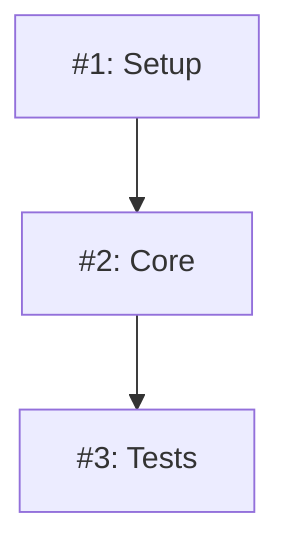

# 🔨 ATOMIZE PLAN: $1

Use the Task tool with the **issue-architect** agent to convert the implementation plan into atomic GitHub issues for systematic execution.

## Process:

### 1. **Read and Parse Plan**
Read the plan document from: `$1` (or `docs/plans/*.md` if not specified)

Extract:
- Feature name and description
- Implementation phases
- Task breakdown section
- Dependencies and requirements

### 2. **Create GitHub Milestone** (if provided)
If milestone name provided as $2:
```bash
gh milestone create "$2" --description "Implementation milestone for feature"
```

### 3. **Generate Issue Structure**

For each atomic task in the plan, create a structured issue:

#### Issue Template:
```markdown
## Task
[Clear task description from plan]

## Acceptance Criteria
- [ ] Implementation complete
- [ ] Tests written and passing
- [ ] Type checking passes
- [ ] Documentation updated

## Context
- **Module**: [module name]
- **Phase**: [Phase 1/2/3]
- **Estimated Effort**: [1-4 hours]
- **Dependencies**: [List any dependent issues]

## Technical Details
[Relevant technical specifications from plan]

## Files to Modify
- [ ] [List expected files from plan analysis]

## Testing Requirements
- Unit tests for new functionality
- Integration tests if applicable
- Manual testing checklist

## References
- Plan Document: $1
- Related Issues: #[numbers]
```

### 4. **Create Issues with Labels**

Use gh CLI to create issues with appropriate labels:

```bash
# Phase 1 - Core Implementation
gh issue create \
  --title "feat(module): Task description" \
  --body "[issue content]" \
  --label "enhancement,phase-1,module-name" \
  --milestone "$2"

# Phase 2 - Integration
gh issue create \
  --title "integrate(module): Task description" \
  --body "[issue content]" \
  --label "enhancement,phase-2,integration" \
  --milestone "$2"

# Phase 3 - Polish
gh issue create \
  --title "enhance(module): Task description" \
  --body "[issue content]" \
  --label "enhancement,phase-3,polish" \
  --milestone "$2"
```

### 5. **Create Issue Tracking Document**

Generate `docs/issues/$1-issues.md` with:

```markdown
# Issue Tracking: [Feature Name]

## Milestone: $2
Created: [date]

## Phase 1 Issues
| Issue # | Title | Status | Assignee | Dependencies |
|---------|-------|--------|----------|--------------|
| #X | Task 1 | Open | - | None |
| #Y | Task 2 | Open | - | #X |

## Phase 2 Issues
[Similar table]

## Phase 3 Issues
[Similar table]

## Dependency Graph

```

### 6. **Update TodoWrite**

Create todo items for tracking:
- [ ] Phase 1: Complete core implementation (X issues)
- [ ] Phase 2: Integration and real data (Y issues)
- [ ] Phase 3: Polish and documentation (Z issues)

### 7. **Generate Summary Report**

Output summary:
- Total issues created: [count]
- Phase distribution: P1: X, P2: Y, P3: Z
- Estimated total effort: [hours]
- Milestone link: [URL]
- First issue to tackle: #[number]

## Execution Notes:

- Each issue should be independently implementable
- Use semantic commit prefixes in issue titles
- Include all necessary context for async work
- Link related issues for better tracking
- Add appropriate labels for filtering