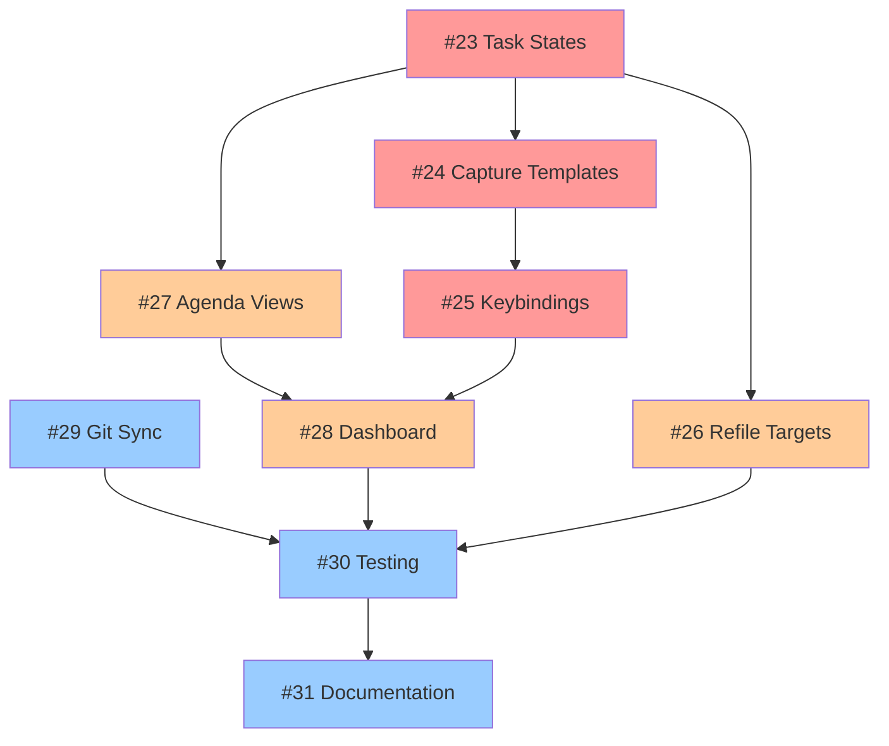

# GTD System Implementation - Issue Tracking

## Overview
This document tracks the GitHub issues created for the systematic implementation of the GTD (Getting Things Done) system in Doom Emacs configuration.

**Total Issues Created**: 9
**Repository**: Adaennnn/doom-emacs-config
**Plan Document**: `docs/plans/gtd-system-PLAN.md`

## Implementation Phases

### Phase 1: Core Configuration (Foundation)
Foundation components that other features depend on.

| Issue | Title | Labels | Estimated Effort | Dependencies |
|-------|-------|--------|------------------|--------------|
| [#23](https://github.com/Adaennnn/doom-emacs-config/issues/23) | feat(gtd): Configure TODO/NEXT/WAITING/DONE task states | `enhancement,phase-1,gtd,config` | 2 hours | None |
| [#24](https://github.com/Adaennnn/doom-emacs-config/issues/24) | feat(gtd): Setup capture templates for universal and contact capture | `enhancement,phase-1,gtd,config` | 3 hours | #23 |
| [#25](https://github.com/Adaennnn/doom-emacs-config/issues/25) | feat(gtd): Configure keybinding scheme for GTD workflow | `enhancement,phase-1,gtd,config` | 2 hours | #24 |

**Phase 1 Total**: 7 hours

### Phase 2: Workflow Integration (Functionality)  
Core GTD workflow features and user interfaces.

| Issue | Title | Labels | Estimated Effort | Dependencies |
|-------|-------|--------|------------------|--------------|
| [#26](https://github.com/Adaennnn/doom-emacs-config/issues/26) | feat(gtd): Configure refile targets and quick keys | `enhancement,phase-2,gtd,config` | 2-3 hours | #23 |
| [#27](https://github.com/Adaennnn/doom-emacs-config/issues/27) | feat(gtd): Configure custom agenda views for GTD workflow | `enhancement,phase-2,gtd,config` | 3-4 hours | #23, #25 |
| [#28](https://github.com/Adaennnn/doom-emacs-config/issues/28) | feat(gtd): Add GTD section to Doom dashboard | `enhancement,phase-2,gtd,config` | 2-3 hours | #27, #25 |

**Phase 2 Total**: 7-10 hours

### Phase 3: Sync & Polish (Advanced)
Advanced features, testing, and documentation.

| Issue | Title | Labels | Estimated Effort | Dependencies |
|-------|-------|--------|------------------|--------------|
| [#29](https://github.com/Adaennnn/doom-emacs-config/issues/29) | feat(gtd): Configure git auto-commit and sync workflow | `enhancement,phase-3,gtd,config` | 3-4 hours | Git repo setup |
| [#30](https://github.com/Adaennnn/doom-emacs-config/issues/30) | test(gtd): Complete end-to-end testing and workflow validation | `test,phase-3,gtd` | 4 hours | #23-29 |
| [#31](https://github.com/Adaennnn/doom-emacs-config/issues/31) | docs(gtd): Update quick reference with actual implementation details | `docs,phase-3,gtd` | 2 hours | #30 |

**Phase 3 Total**: 9-10 hours

## Dependency Graph

## Progress Tracking

### Status Legend
- 🔴 **Not Started**: Issue created but work not begun
- 🟡 **In Progress**: Currently being worked on
- 🟢 **Complete**: Issue resolved and tested
- ⚫ **Blocked**: Waiting on dependencies

### Current Status
| Phase | Issues | Not Started | In Progress | Complete | Blocked |
|-------|--------|-------------|-------------|----------|---------|
| Phase 1 | 3 | 🔴🔴🔴 | - | - | - |
| Phase 2 | 3 | 🔴🔴🔴 | - | - | - |
| Phase 3 | 3 | 🔴🔴🔴 | - | - | - |
| **Total** | **9** | **9** | **0** | **0** | **0** |

## Implementation Strategy

### Recommended Execution Order
1. **Start with Phase 1 Foundation** (#23 → #24 → #25)
   - Task states are prerequisite for everything else
   - Capture templates need task states but enable testing
   - Keybindings provide user interface access

2. **Build Phase 2 Functionality** (#26, #27, #28)
   - Refile targets can be implemented in parallel with agenda views
   - Dashboard integration should come last in this phase

3. **Polish with Phase 3** (#29, #30, #31)
   - Git sync can be implemented independently
   - Testing requires all previous components
   - Documentation updates come last

### Parallel Work Opportunities
- **#26 (Refile)** and **#27 (Agenda)** can be worked simultaneously after #23
- **#29 (Git Sync)** can be implemented independently at any time
- **#28 (Dashboard)** should wait for agenda views but could start after #25

### Critical Path
The longest dependency chain is: `#23 → #24 → #25 → #27 → #28 → #30 → #31`

**Estimated Critical Path Time**: 16-19 hours

## Quick Links

### Issues by Priority
- **High Priority (Blockers)**: [#23](https://github.com/Adaennnn/doom-emacs-config/issues/23)
- **Medium Priority**: [#24](https://github.com/Adaennnn/doom-emacs-config/issues/24), [#25](https://github.com/Adaennnn/doom-emacs-config/issues/25), [#27](https://github.com/Adaennnn/doom-emacs-config/issues/27)
- **Low Priority**: [#26](https://github.com/Adaennnn/doom-emacs-config/issues/26), [#28](https://github.com/Adaennnn/doom-emacs-config/issues/28), [#29](https://github.com/Adaennnn/doom-emacs-config/issues/29)

### Key Files to Modify
- **Primary**: `/home/adaen/.config/doom/config.el` (all configuration issues)
- **Secondary**: `/home/adaen/org/sync.sh` (sync script)
- **Documentation**: `/home/adaen/org/docs/GTD-QUICK-REFERENCE.md`

### Testing Data Requirements
- Sample tasks in `~/org/gtd/inbox.org`
- Test project in `~/org/gtd/projects.org`
- Test contacts in `~/org/gtd/contacts.org`
- Various task states (TODO/NEXT/WAITING/DONE)

## Success Metrics
Based on the plan document, success will be measured by:
- **Capture Time**: < 10 seconds per item
- **Inbox Processing**: Daily processing to zero
- **Project Management**: All projects have NEXT actions
- **Review Consistency**: Weekly reviews completed
- **System Reliability**: No missed deadlines, reliable sync

## Notes
- All issues include comprehensive acceptance criteria and technical details
- Each issue is sized for 1-4 hour implementation blocks
- Dependencies are clearly documented to avoid blocked work
- Testing requirements are specified for each component
- Implementation follows Doom Emacs patterns and conventions

---

*Generated on 2025-09-06 by issue-architect agent*
*Last updated: Issue creation (9 issues)*